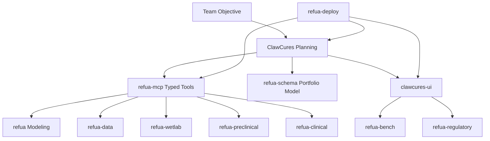

# Refua and ClawCures Guidebook

This guidebook is a textbook-style manual for the AgentCures ecosystem.
It teaches both the science and the system design, so readers can move from "I have a drug discovery objective" to "I have an executable, auditable campaign."

## Who This Is For

- Research engineers learning discovery workflows
- Computational scientists building model pipelines
- Platform engineers operating campaign infrastructure
- Wet-lab and preclinical teams integrating operational evidence
- Clinical strategy teams planning trial simulations
- QA, governance, and regulatory stakeholders reviewing readiness

## How To Use This Guidebook

Pick a reading track:

- Fast onboarding track: Chapters 1, 2, 4, 8
- Science depth track: Chapters 1, 3, 5, 9, 10
- Operations track: Chapters 2, 5, 7, 8
- Governance track: Chapters 5, 6, 8, Appendix B

## Narrative Arc

If you read straight through, the guidebook follows one continuous story:

1. understand how discovery decisions are actually made under uncertainty
2. learn how the platform turns intent into typed, executable workflows
3. run an end-to-end campaign with evidence and gate controls
4. deepen into medicinal chemistry and development-stage decision science

## Chapter Index

1. [Chapter 1: Drug Discovery For Builders](./chapter-01-drug-discovery-for-builders.md)
2. [Chapter 2: Platform Architecture](./chapter-02-platform-architecture.md)
3. [Chapter 3: Refua Core Science Engine](./chapter-03-refua-core-science-engine.md)
4. [Chapter 4: ClawCures Campaign Orchestrator](./chapter-04-clawcures-campaign-orchestrator.md)
5. [Chapter 5: Program Lifecycle Modules](./chapter-05-program-lifecycle-modules.md)
6. [Chapter 6: Quality, Governance, and Evidence](./chapter-06-quality-governance-and-evidence.md)
7. [Chapter 7: Deployment and Runtime Operations](./chapter-07-deployment-and-runtime-operations.md)
8. [Chapter 8: End-to-End Walkthrough](./chapter-08-end-to-end-walkthrough.md)
9. [Chapter 9: Medicinal Chemistry and Molecular Optimization](./chapter-09-medicinal-chemistry-and-molecular-optimization.md)
10. [Chapter 10: Drug Discovery and Development Science](./chapter-10-drug-discovery-and-development-science.md)
11. [Appendix A: Glossary](./appendix-a-glossary.md)
12. [Appendix B: Artifacts and Schemas](./appendix-b-artifacts-and-schemas.md)

## Data And Rich Artifacts

Use these artifacts while reading:

- [Campaign lifecycle data (CSV)](./data/campaign_lifecycle_example.csv)
- [Traceability matrix (CSV)](./data/traceability_matrix.csv)
- [Tool call examples (JSON)](./data/tool_calls_example.json)
- [Medicinal chemistry property guide (CSV)](./data/medchem_property_guide.csv)
- [Development stage-gate map (CSV)](./data/development_stage_gates.csv)

## Ecosystem In One Diagram

## Teaching Style Used In Chapters

Each chapter follows a consistent layout:

- learning goals
- conceptual model
- concrete package mapping
- practical checklists
- common failure modes
- chapter handoff to next topics

## Conventions

- "Campaign" means one executable objective with traceable artifacts.
- "Tool call" means a typed JSON request handled through `refua-mcp`.
- "Gate" means a formal quality or policy checkpoint.
- "Evidence" means reproducible and integrity-verifiable outputs.

## Important Scope Note

This guidebook describes software, simulation, and operational workflows.
It does not claim therapeutic efficacy or regulatory approval outcomes.
