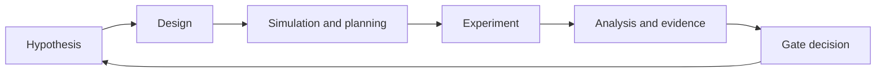
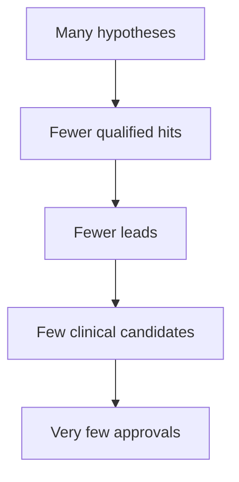

# Chapter 1: Drug Discovery For Builders

## Chapter Summary

This chapter builds the core mental model for drug discovery as an uncertainty-reduction system.
It explains why programs fail, how multi-objective tradeoffs shape decisions, and why disciplined loops plus explicit evidence gates matter more than any single prediction metric.

## Learning Goals

By the end of this chapter, you should be able to:

- explain the full discovery-to-development arc in clear, practical terms
- identify where uncertainty is highest in each stage
- understand how computational and experimental loops reinforce each other
- translate a broad mission into measurable stage objectives

## Story Thread

Imagine a new team walking into its first campaign meeting with a huge mission statement and no shared process.
This chapter gives that team a common language: where uncertainty lives, how tradeoffs appear, and why disciplined loops matter more than heroic one-off bets.
If Chapter 1 works, teams leave with focus, not just ambition.

## 1.1 Why This Field Is Hard

Drug discovery is an optimization problem with incomplete information.

You do not know in advance:

- whether your target is truly causal for disease
- whether your chemistry can satisfy potency, safety, exposure, and manufacturability together
- whether preclinical effects will translate to human outcomes

So the real job is not "prove success quickly."
The real job is to run disciplined loops that reduce uncertainty with high signal quality.

## 1.2 The Core Cycle

Every mature discovery organization repeats this cycle many times.
The difference between good and bad programs is not avoiding failure, but learning from failure faster and with better evidence quality.

## 1.3 Stages In Plain Language

| Stage | Practical Question | Typical Output |
| --- | --- | --- |
| Disease framing | Which disease and subpopulation matter most now? | objective, burden rationale, scope |
| Target strategy | Which biological mechanism is actionable? | target hypothesis and assay strategy |
| Hit finding | Which starting molecules show real signal? | hit list and assay data |
| Lead optimization | Which series balances potency, safety, exposure? | lead series and SAR rationale |
| Preclinical planning | Can we support human translation decisions? | study design, PK/safety workups |
| Clinical design science | What trial design gives robust decision power? | protocol options, simulation outputs |
| Governance | Is the evidence complete and auditable? | lineage, checksums, checklist results |

## 1.4 Why Most Programs Fail

Programs usually fail for one of five reasons:

1. biology risk: target does not drive disease as expected
2. molecule risk: potency improves while liabilities grow
3. translation risk: animal/in vitro signal does not predict human behavior
4. design risk: trial structure cannot detect true effect reliably
5. execution risk: weak provenance, weak controls, weak data quality

A realistic platform must reduce all five, not only optimize one model metric.

## 1.5 Multi-Objective Tradeoffs

| Dimension | What Teams Want | Typical Tension |
| --- | --- | --- |
| Potency | strong target engagement | may increase off-target effects |
| Selectivity | clean biology | may reduce potency if scaffold constrained |
| Exposure | sufficient concentration at site | may conflict with safety or formulation |
| Safety | acceptable risk profile | may require chemistry compromises |
| Developability | scalable, stable product | may force redesign of otherwise potent molecules |
| Clinical operability | feasible enrollment and endpoint capture | may constrain pure statistical ideal designs |

Textbook lesson: there is no free lunch; good decisions are tradeoff decisions with transparent rationale.

## 1.6 Discovery As A System, Not A Script

A robust discovery stack separates concerns:

- planning intelligence: what to do next (`ClawCures`)
- typed execution: how to run tools safely (`refua-mcp`)
- scientific inference: folding, affinity, design (`refua`)
- lifecycle modules: data, wet-lab, preclinical, clinical workflows
- quality and governance: benchmark and evidence checks

This separation improves correctness, auditability, and team velocity.

## 1.7 Time, Cost, and Attrition

Discovery has a funnel shape and high attrition.

Practical implication:

- fail early with strong evidence
- avoid over-investing in weak programs
- keep artifacts reproducible so rework is efficient

## 1.8 Metrics That Matter Early

Early-stage metrics should be both scientific and operational.

Scientific:

- binding/activity trend quality
- ADMET liability trend
- preclinical PK/safety plausibility
- trial operating characteristic plausibility

Operational:

- schema validity of tool calls
- reproducibility of outputs
- benchmark gate status
- completeness of lineage and checklist artifacts

## 1.9 Common Beginner Misconceptions

- "A high predicted affinity means candidate success."
  - reality: affinity is one signal, not the full decision basis.
- "If one assay looks good, we can advance."
  - reality: orthogonal evidence reduces false positives.
- "Governance can wait until late stage."
  - reality: late governance gaps are expensive and risky.

## 1.10 Practical Workflow For New Teams

1. pick one disease objective with clear scope
2. define one target hypothesis and one measurable success criterion
3. run a small campaign loop end-to-end
4. capture every artifact and gate decision
5. review what failed and improve process before scaling

This approach builds organizational muscle faster than trying to optimize everything at once.

## Key Takeaways

- Drug discovery is a looped decision system, not a single experiment or model run.
- Most failures come from compounding risks across biology, chemistry, translation, and execution quality.
- Strong teams optimize across multiple constraints instead of chasing one headline metric.
- Architecture and process quality directly influence scientific reliability.
- Early-stage discipline in artifacts and gates prevents expensive late-stage confusion.

## Quick Review Questions

1. Why is drug discovery best treated as uncertainty reduction rather than linear execution?
2. Which two failure modes are most likely in your current stage, and why?
3. What tradeoff are you currently optimizing, and what might be getting underweighted?
4. Which artifacts are mandatory for your next stage-gate decision?
5. How would you redesign one loop in your current workflow to improve signal quality?

## Mini Case Study

**Scenario:** A new team starts with the objective \"find a cure for all cancers this quarter\" and runs one large campaign loop.
The output is broad, hard to rank, and cannot support concrete next steps.

**Decision Move:** The team narrows scope to one subtype, one target hypothesis, and one measurable 8-week outcome.
They rerun a smaller loop with explicit artifacts and gate criteria.

**Result:** The second run produces a usable candidate shortlist, clear uncertainties, and a reproducible next-loop plan.

**Lesson:** Scope clarity is the first quality control in discovery.

## 1.11 Chapter Checkpoint

If you can answer these, you are ready for Chapter 2:

- What are the highest uncertainty points in your current stage?
- Which tradeoff are you currently optimizing, and which are you ignoring?
- Which artifacts would you need to justify your next stage-gate decision?

## 1.12 Continue Reading

- architecture and system boundaries: [Chapter 2](./chapter-02-platform-architecture.md)
- deeper medicinal chemistry strategy: [Chapter 9](./chapter-09-medicinal-chemistry-and-molecular-optimization.md)
- discovery-to-development stage science: [Chapter 10](./chapter-10-drug-discovery-and-development-science.md)
