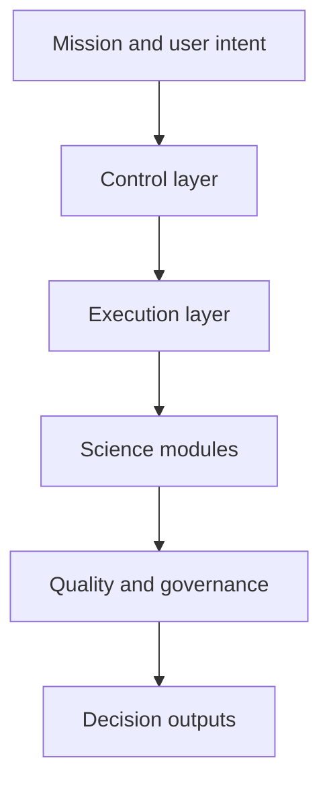
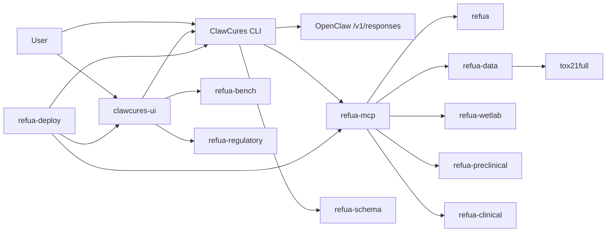
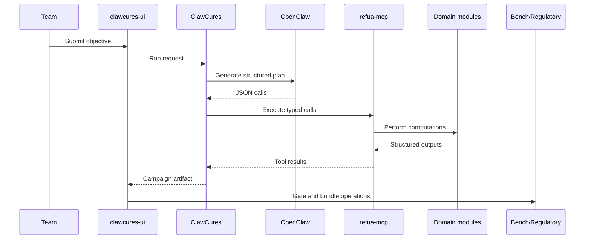

# Chapter 2: Platform Architecture

## Chapter Summary

This chapter explains how the ecosystem separates planning, typed execution, scientific modules, and governance so each layer can evolve without destabilizing the others.
It also provides a practical debugging model for isolating failures by layer instead of chasing symptoms.

## Learning Goals

By the end of this chapter, you should be able to:

Describe how control, science, and governance layers are separated. Trace a request from objective definition to evidence bundle. Understand why strict typed contracts are central to reliability. Identify where to debug issues when a workflow breaks.

## Story Thread

Think of one objective traveling through the system like a baton in a relay race.
Each layer has one job, one interface, and one accountability boundary.
When those boundaries are clear, teams can move quickly without losing control.

## 2.1 Architecture Philosophy

The ecosystem is built around one core principle:

Plan with language reasoning and execute with typed deterministic interfaces.

That gives teams flexibility in strategy while preserving operational safety.

## 2.2 Layered System Model

Concrete mapping:

Control layer: `ClawCures`, `clawcures-ui`. Execution layer: `refua-mcp`. Science modules: `refua`, `refua-data`, `tox21full`, `refua-wetlab`, `refua-preclinical`, `refua-clinical`. Portfolio/object model: `refua-schema`. Quality/governance: `refua-bench`, `refua-regulatory`. Runtime packaging: `refua-deploy`.

## 2.3 Topology Diagram

## 2.4 Control Plane vs Scientific Plane

| Plane | Components | Primary Responsibility |
| --- | --- | --- |
| Mission/control | `ClawCures`, `clawcures-ui` | objective handling, plan orchestration, policy constraints |
| Typed execution | `refua-mcp` | schema validation, tool dispatch, async job contracts |
| Scientific execution | `refua` and lifecycle/data modules | model inference, simulation, dataset generation, operational analysis |
| Portfolio/object model | `refua-schema` | portfolio composition, reusable discovery objects, serialized artifact contracts |
| Quality/governance | `refua-bench`, `refua-regulatory` | regression control, lineage, integrity verification |
| Runtime/deploy | `refua-deploy` | environment bootstrap, bundle render, operations portability |

## 2.5 Request Lifecycle

## 2.6 Why Strict Contracts Matter

Loose text integration fails under scale.
Strict contracts help with:

Deterministic execution. Predictable error handling. Easier CI validation. Easier security boundaries. Easier reproducibility and audit review.

In this architecture, typed JSON is not a detail. It is the reliability foundation.

## 2.7 Interface Boundaries

| Boundary | Rule | Benefit |
| --- | --- | --- |
| Planner to orchestrator | strict plan JSON only | prevents unstructured ambiguity |
| Orchestrator to tools | allowlisted typed calls | reduces unsafe or irrelevant tool usage |
| Modules to governance | explicit artifact handoff | enables lineage and integrity checks |
| Runtime to operators | declarative deploy outputs | improves repeatability across environments |

## 2.8 Failure Isolation

When a run fails, isolate by layer:

1. planning failure: malformed or low-quality plan from OpenClaw
2. contract failure: schema or validation error at MCP boundary
3. module failure: scientific/operational tool error
4. governance failure: benchmark/checklist gate failed
5. runtime failure: service/network/dependency issue

This diagnostic path shortens mean time to resolution.

## 2.9 Observability Mindset

Minimum observability for each run:

Objective and request metadata. Plan payload and policy trace. Per-tool call inputs/outputs (sanitized as needed). Run status transitions and timing. Gate decisions and reviewer notes.

Without this, teams lose confidence and spend time on forensic debugging.

## 2.10 Architecture Design Principles Reused Everywhere

Typed over ad hoc. Explicit over implicit. Reproducible over convenient. Policy-constrained over unconstrained autonomy. Stage-gated over optimistic progression.

## Key Takeaways

Planning and execution are intentionally separated to combine flexibility with safety. Typed contracts are the operational backbone of reliability and reproducibility. Layer boundaries make failures easier to isolate and fix quickly. Governance and deployment are architecture components, not optional add-ons. Observability must track objectives, calls, outputs, and gate outcomes together.

## Quick Review Questions

1. Where does schema validation happen, and what does it protect against?
2. Which layer should you inspect first if calls are valid but outputs are poor quality?
3. Why does strict JSON planning improve reproducibility across teams?
4. What evidence should be logged at every boundary crossing?
5. Which architecture principle is currently weakest in your workflow?

## Mini Case Study

**Scenario:** A campaign fails mid-run with \"missing field\" errors and the team initially blames model quality.

**Decision Move:** They isolate by layer and find the break at the planner-to-orchestrator boundary: output was narrative text instead of strict `calls[]` JSON.
They tighten prompt constraints and add plan-shape prevalidation.

**Result:** Failure rate drops immediately, and later debugging becomes faster because errors map cleanly to one layer.

**Lesson:** Layer isolation prevents wasted debugging effort.

## 2.11 Chapter Checkpoint

You are ready for Chapter 3 if you can explain:

Why planning and execution are separated. Where schema validation occurs. Which layer owns quality gates.

## 2.12 Continue Reading

Core scientific engine internals: [Chapter 3](./chapter-03-refua-core-science-engine.md) and orchestration logic and policies: [Chapter 4](./chapter-04-clawcures-campaign-orchestrator.md).
