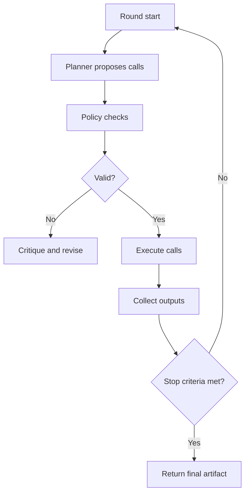

# Chapter 4: ClawCures Campaign Orchestrator

## Chapter Summary

This chapter details how `ClawCures` turns mission intent into controlled execution by combining OpenClaw planning with strict MCP tool dispatch.
It focuses on policy constraints, autonomous loop behavior, and the quality of campaign artifacts that feed downstream teams.

## Learning Goals

By the end of this chapter, you should be able to:

- explain how ClawCures separates planning from execution
- understand planner, policy, and tool-dispatch responsibilities
- reason about autonomous loops and safety constraints
- produce high-quality campaign artifacts for downstream teams

## Story Thread

Picture an objective entering the system as plain language and leaving as structured, auditable execution.
`ClawCures` sits in that transformation step: planning, constraining, dispatching, and recording.
This chapter explains how autonomy is made useful by policy, not by removing guardrails.

## 4.1 What ClawCures Owns

`ClawCures` is the campaign brain.
Its job is not to run every scientific model directly.
Its job is to:

- interpret mission objectives
- obtain structured tool plans from OpenClaw
- enforce policy and allowlists
- dispatch typed calls through `refua-mcp`
- synthesize outputs into campaign-level artifacts

## 4.2 Architectural Split


This split makes autonomous planning powerful without giving it unrestricted execution authority.

## 4.3 Internal Components

| Component | Role | Why It Matters |
| --- | --- | --- |
| `OpenClawClient` | calls `/v1/responses` and extracts text | planner integration boundary |
| `CampaignOrchestrator` | builds prompt context, parses plan, dispatches calls | central control logic |
| `RefuaMcpAdapter` | executes allowlisted typed tools | safety and contract enforcement |
| `AutonomousPlanner` | multi-round planner/critic loop | iterative planning quality |
| `portfolio` | disease-program ranking logic | strategic prioritization |

## 4.4 Plan Contract

Plans must be strict JSON:

```json
{
  "calls": [
    {
      "tool": "refua_validate_spec",
      "args": {
        "entities": []
      }
    }
  ]
}
```

No markdown wrappers, no narrative blocks, no ad hoc command strings.
This requirement is central to reliable automation.

## 4.5 Policy Controls

Typical policy controls include:

- tool allowlist checks
- maximum call count
- validation-first preference
- dry-run and offline plan validation
- optional autonomous-round limits

These controls reduce bad plans, uncontrolled costs, and unsafe execution patterns.

## 4.6 Autonomous Planner Loop



Operational recommendation:

- start with low round and call limits
- inspect critique traces
- expand autonomy only after stable behavior

## 4.7 Campaign Artifact Structure

A useful campaign artifact usually includes:

- objective and runtime metadata
- planned and executed tool calls
- raw and summarized tool outputs
- promising-cure ranking entries
- policy trace and critique context
- warnings and unresolved risks

These fields make downstream preclinical/clinical/governance workflows much easier.

## 4.8 Portfolio Ranking In Strategy

Portfolio ranking helps answer:

- where should we invest scarce compute and team bandwidth first?
- which disease programs have highest impact-adjusted feasibility?

Typical ranking factors include disease burden, technical feasibility, evidence depth, and operational tractability.

## 4.9 Failure Modes And Fixes

| Failure Mode | Likely Cause | First Fix |
| --- | --- | --- |
| malformed plan JSON | planner output drift | tighten plan prompt and local validation |
| repeated invalid calls | weak policy feedback loop | strengthen critique instructions and prechecks |
| expensive no-op runs | missing validate-first behavior | enforce validation-first policy hard rule |
| low-value outputs | vague objective framing | add explicit success criteria and constraints |
| governance friction later | missing provenance in outputs | require provenance fields during synthesis |

## 4.10 Prompt Quality Matters

Better campaign prompts:

- specify objective scope and constraints
- require measurable milestones
- require typed tool call format
- forbid unsupported claims
- request explicit uncertainty reporting

Poor prompts cause low-signal plans and wasted cycles.

## 4.11 Practical Operator Checklist

Before running a large campaign:

1. confirm OpenClaw connectivity and auth
2. confirm MCP tool availability
3. set max calls and max rounds conservatively
4. run one dry-run or offline plan validation
5. verify output artifact path and retention policy

## Key Takeaways

- `ClawCures` owns planning control and policy enforcement, not raw scientific execution.
- Strict plan contracts prevent ambiguity and make automation reliable.
- Autonomous loops require explicit limits, critique traces, and guardrails.
- High-quality campaign artifacts must include both results and decision context.
- Better objective framing usually yields better, lower-waste planning behavior.

## Quick Review Questions

1. Why should plan generation and tool execution remain separated systems?
2. Which policy control would most reduce wasted runs in your environment?
3. What fields are non-negotiable in a campaign artifact for governance handoff?
4. How should you respond when autonomous planning repeatedly violates policy?
5. What objective rewrite would likely improve your next campaign plan quality?

## Mini Case Study

**Scenario:** An autonomous run repeatedly proposes expensive fold calls before validation and exceeds expected compute budget.

**Decision Move:** Operators enforce validation-first policy, lower round limits, and require critique traces to explain rejected calls.

**Result:** Call quality improves, invalid calls decrease, and compute spend aligns with planned campaign scope.

**Lesson:** Policy controls are not friction; they are efficiency and safety mechanisms.

## 4.12 Chapter Checkpoint

You are ready for Chapter 5 if you can answer:

- where policy checks happen
- why strict JSON plan contracts are non-negotiable
- how campaign artifacts feed later stage modules

## 4.13 Continue Reading

- package interactions across the lifecycle: [Chapter 5](./chapter-05-program-lifecycle-modules.md)
- governance and evidence quality gates: [Chapter 6](./chapter-06-quality-governance-and-evidence.md)
