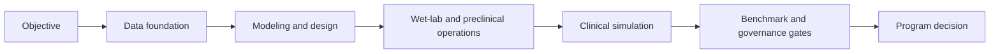
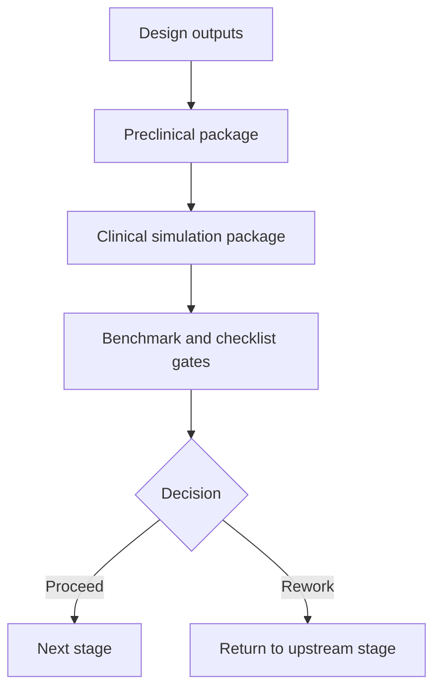

# Chapter 5: Program Lifecycle Modules

## Chapter Summary

This chapter maps the full program lifecycle across ecosystem modules and shows how stage-to-stage artifact contracts enable cross-team execution without losing traceability.
It emphasizes ownership clarity, schema discipline, and gate-aware handoffs.

## Learning Goals

By the end of this chapter, you should be able to:

Map each package to concrete stage responsibilities. Understand how artifacts flow from one module to the next. Identify where stage transitions need explicit quality gates. Design cross-team workflows that stay reproducible.

## Story Thread

Real programs are team sports across data, modeling, wet-lab, preclinical, clinical, QA, and operations.
This chapter tracks how work moves across those teams without losing meaning.
The central theme is simple: strong handoffs are built from clear contracts, not good intentions.

## 5.1 Lifecycle As A Pipeline

This pipeline is not strictly linear in practice.
Teams loop backward whenever gate outcomes indicate risk.

## 5.2 Module Map

| Module | Primary Scope | Typical Artifacts |
| --- | --- | --- |
| `refua-data` | dataset catalog, fetch, materialization | raw cache, metadata, parquet manifests |
| `tox21full` | Tox21 toxicity dataset generation | PubChem BioAssay extraction outputs, multi-task assay matrices, dataset manifests |
| `refua` | fold, affinity, design, property analysis | structure outputs, affinity metrics, property payloads |
| `refua-mcp` | typed tool interface + validation | structured tool results, async job IDs |
| `ClawCures` | planning, policy, campaign orchestration | plan JSON, campaign run artifact, rankings |
| `clawcures-ui` | command center and workflow API | job records, run dashboards, orchestration logs |
| `refua-wetlab` | protocol compile/run and LMS | run lineage, sample/inventory records |
| `refua-preclinical` | planning, scheduling, bioanalysis, CMC | workups, plans, schedule and release assessments |
| `refua-clinical` | trial simulation and optimization | run summaries, protocol options, VOI reports |
| `refua-schema` | portfolio composition and schema reuse | portfolio YAML/JSON, disease/rationale/drug objects, nested cross-module artifacts |
| `refua-bench` | regression and benchmark gates | compare reports, pass/fail decisions |
| `refua-regulatory` | evidence bundle build and verify | manifest, lineage graph, checksums, checklist output |
| `refua-deploy` | deployment and runtime packaging | manifests/scripts/env templates |

## 5.3 Artifact Hand-Off Design

Good hand-offs are explicit and machine-readable.

| Upstream | Downstream | Contract Expectation |
| --- | --- | --- |
| `refua-data` manifest | `refua-regulatory` | immutable source and checksum metadata |
| `refua` outputs | `ClawCures` ranking and `refua-clinical` integration | stable field names and units/context |
| lifecycle module outputs | `refua-schema` portfolio artifacts | canonical `Portfolio -> Disease -> Rationale -> Drug` hierarchy with reusable nested objects |
| wet-lab run lineage | governance review | complete run IDs and event timestamps |
| preclinical outputs | clinical strategy and stage-gate review | clear assumptions and uncertainty fields |
| benchmark reports | release decisions | threshold definitions and statistical context |

## 5.4 Studio As Integration Fabric

`clawcures-ui` is where teams coordinate lifecycle operations in one place.
It unifies:

Campaign planning/execution. Data catalog operations. Wet-lab workflows. Preclinical and clinical workflows. Benchmarking and evidence bundling.

This reduces context switching and keeps stage transitions visible.

## 5.5 Cross-Team Ownership Model

A practical ownership pattern:

Platform team: orchestration reliability and contracts. Modeling team: structure/affinity/design workflows. Wet-lab team: protocol execution and sample lineage. Preclinical team: study and CMC planning outputs. Clinical team: protocol simulation and decision framing. QA/regulatory team: evidence integrity and gate compliance.

Clear ownership avoids hidden accountability gaps.

## 5.6 Stage-Gate Dependencies

Design implication:

Every stage should produce artifacts that can be reviewed independently and no stage should rely only on verbal transfer of conclusions.

## 5.7 Data Quality And Schema Discipline

Common lifecycle friction comes from schema drift.
Prevent it by:

1. using typed MCP tools whenever possible
2. versioning artifact schemas
3. validating required fields in CI
4. preserving metadata snapshots with each run

## 5.8 Operational Metrics Worth Tracking

| Metric | Why It Matters |
| --- | --- |
| time-to-first-valid-plan | planning and prompt quality indicator |
| tool call validation failure rate | schema/contract stability indicator |
| stage-gate rework rate | quality of upstream evidence indicator |
| benchmark regression frequency | model release stability indicator |
| checklist manual-review backlog | governance capacity indicator |

## 5.9 Common Lifecycle Anti-Patterns

Ad hoc one-off scripts outside typed interfaces. Manual artifact editing without lineage events. Skipping benchmark gates under schedule pressure. Large stage transitions with unclear ownership.

These issues compound quickly as programs scale.

## 5.10 Reference Data In This Guidebook

Lifecycle events: [campaign_lifecycle_example.csv](./data/campaign_lifecycle_example.csv) and decision traceability: [traceability_matrix.csv](./data/traceability_matrix.csv).

Use these files as templates when creating internal reporting pipelines.

## Key Takeaways

Lifecycle reliability depends on explicit module boundaries and artifact contracts. Studio improves coordination, but domain modules remain source-of-truth for execution. Stage transitions should be data-backed and ownership-backed, not conversational. Schema discipline is essential for scaling multi-team workflows. Gate outcomes should be integrated into everyday operations, not end-stage paperwork.

## Quick Review Questions

1. Which artifact handoff in your lifecycle is currently most fragile?
2. Who is accountable for each gate in your next stage transition?
3. What schema validation should be added immediately to reduce rework?
4. Where are you still relying on manual narrative instead of structured artifacts?
5. Which lifecycle metric would most improve decision speed in your team?

## Mini Case Study

**Scenario:** A preclinical team receives a candidate package but cannot trace which dataset and model versions produced the ranking.

**Decision Move:** The platform team adds mandatory provenance fields and a handoff checklist to the campaign artifact contract.

**Result:** Stage transitions become faster because downstream teams can trust and reuse upstream evidence without rework.

**Lesson:** Good lifecycle flow is mostly an artifact-contract problem, not a meeting problem.

## 5.11 Chapter Checkpoint

You are ready for Chapter 6 if you can answer:

Which artifact is required before your next stage transition. Who owns each gate in your workflow. Where schema validation is currently enforced.

## 5.12 Continue Reading

Quality and governance deep dive: [Chapter 6](./chapter-06-quality-governance-and-evidence.md). Medicinal chemistry depth for design loops: [Chapter 9](./chapter-09-medicinal-chemistry-and-molecular-optimization.md). Development science stage strategy: [Chapter 10](./chapter-10-drug-discovery-and-development-science.md).
