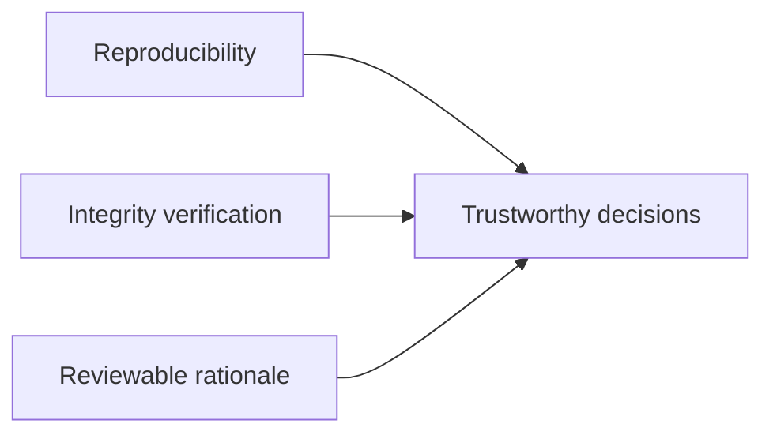
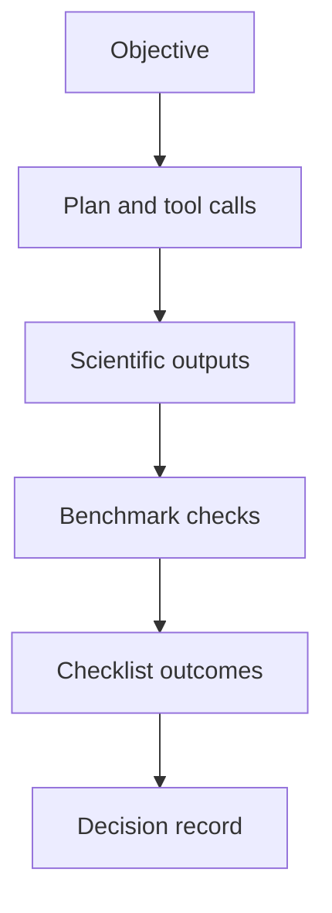

# Chapter 6: Quality, Governance, and Evidence

## Chapter Summary

This chapter explains governance as a scientific quality function, not an administrative afterthought.
It shows how benchmark gates, evidence bundles, traceability, and manual-review discipline combine to support credible stage-gate decisions.

## Learning Goals

By the end of this chapter, you should be able to:

Define what makes a campaign artifact auditable. Apply benchmark and checklist gates consistently. Design a traceability workflow that survives handoffs and review cycles. Understand where uncertainty and manual review belong in decisions.

## Story Thread

Sooner or later, every team reaches the same moment: someone asks, \"show me exactly why we made this decision.\"
This chapter prepares for that moment.
It shows how governance practices turn technical outputs into evidence that stands up under scrutiny.

## 6.1 Why Governance Is Not Optional

In discovery systems, governance is part of scientific quality.
If teams cannot reconstruct how a decision was produced, confidence collapses.

Good governance answers:

What data and model produced this output? What policy/gate checks were applied? What risks remained unresolved when decision was made?

## 6.2 Three Pillars

Reproducibility: rerun pathways and metadata completeness. Integrity: checksum and artifact immutability checks. Reviewability: clear decisions linked to explicit evidence.

## 6.3 Benchmark Gates With `refua-bench`

`refua-bench` supports:

Task-level benchmark suite definitions. Baseline vs candidate comparisons. Tolerance and effect-size rules. Bootstrap confidence checks. Safe baseline promotion flows.

This prevents silent degradation when models or data change.

## 6.4 Why Statistical Gating Matters

Small numerical differences can be meaningless.
Gating should distinguish:

Meaningful regression. Expected variance. Inconclusive result requiring more data.

Treating all deltas as equal leads to noisy, low-quality release decisions.

## 6.5 Regulatory Evidence With `refua-regulatory`

Evidence bundles usually include:

`manifest.json`. `decisions.jsonl`. `lineage.json`. `checksums.sha256`. Checklist outputs.

Verification then confirms integrity and completeness before review handoff.

## 6.6 Decision Traceability

Each arrow must be backed by an artifact reference, not memory.

## 6.7 Traceability Matrix Pattern

Use tabular mapping between decisions and evidence.
Reference template:

[traceability_matrix.csv](./data/traceability_matrix.csv).

Minimum fields to enforce in reviews:

Decision ID. Objective. Input/output artifact refs. Data and model provenance refs. Benchmark status. Checklist status. Final decision and owner.

## 6.8 Manual Review Is A Feature, Not A Failure

Some decisions should remain manual-review items.
Examples:

Unresolved safety interpretation. Jurisdiction-specific regulatory interpretation. High-impact portfolio investment inflection.

The right behavior is to track manual-review status explicitly, not hide it.

## 6.9 Governance Workflow Template

1. verify all required artifacts exist
2. validate schema and provenance completeness
3. run benchmark compare and record result
4. run checklist and capture automated + manual items
5. perform decision review meeting with explicit unresolved risks
6. publish signed or approved stage-gate record

## 6.10 Common Governance Failure Modes

| Failure | Consequence | Mitigation |
| --- | --- | --- |
| missing provenance fields | impossible audit reconstruction | enforce field presence in CI |
| mutable artifacts after review | trust breakdown | immutability and checksum verification |
| gates skipped under pressure | hidden regression risk | policy-enforced blocking rules |
| vague final decision notes | rework confusion | structured decision templates |

## 6.11 Evidence Quality Checklist

Before approving advancement:

Are all critical tool calls typed and validated? Are model versions and dependency snapshots attached? Are data manifests and checksums included? Are benchmark outcomes statistically interpretable? Are manual-review items clearly identified and assigned? Is final decision linked to explicit artifacts?

## Key Takeaways

Governance quality directly affects scientific decision quality. Benchmark gates protect against silent performance regression. Evidence bundles must be both complete and integrity-verifiable. Manual review should be explicit, tracked, and assigned. Decision traceability works only when artifacts are structured and stable.

## Quick Review Questions

1. What makes an artifact set auditable in your organization?
2. Which gate should block progression automatically, and why?
3. Where are manual-review items currently under-documented?
4. How would you verify provenance completeness before a review board?
5. What governance failure mode is most likely in your current workflow?

## Mini Case Study

**Scenario:** A model update appears to improve a key metric, and stakeholders request immediate promotion.

**Decision Move:** QA runs benchmark gating and detects performance uncertainty on high-priority tasks. Regulatory review also finds missing checksum evidence.

**Result:** Promotion is paused, remediation tasks are assigned, and the next review packet is complete and defensible.

**Lesson:** Governance prevents false confidence from incomplete or noisy evidence.

## 6.12 Chapter Checkpoint

You are ready for Chapter 7 if you can answer:

What artifact set is required for your next review board. Which gate can block progression automatically. What unresolved risk must remain manual-review today.

## 6.13 Continue Reading

Deployment and runtime operations: [Chapter 7](./chapter-07-deployment-and-runtime-operations.md) and full applied flow: [Chapter 8](./chapter-08-end-to-end-walkthrough.md).
