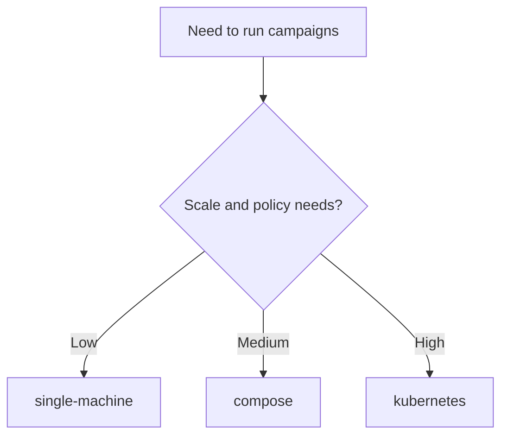
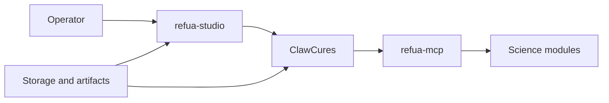

# Chapter 7: Deployment and Runtime Operations

## Chapter Summary

This chapter frames deployment as a reliability and evidence-quality concern, then provides a practical operating model across single-machine, compose, and Kubernetes modes.
It includes runbook patterns for readiness checks, incident isolation, and secure service operation.

## Learning Goals

By the end of this chapter, you should be able to:

Choose the right deployment mode for your team and risk profile. Understand how runtime topology impacts reliability and security. Apply practical runbook patterns for healthy operations. Avoid common deployment anti-patterns in scientific platforms.

## Story Thread

Many workflows look strong in notebooks and fail under real operating conditions.
This chapter follows the practical side of making systems dependable day after day.
The focus is operational clarity: run readiness, failure isolation, and secure defaults.

## 7.1 Deployment Is Part Of Scientific Quality

If runtime is unstable, scientific outputs become less trustworthy.
Operations quality affects:

Reproducibility. Latency and throughput. Failure recovery. Audit readiness.

So deployment is not separate from science. It is part of scientific execution quality.

## 7.2 Supported Modes

| Mode | Typical Context | Strength |
| --- | --- | --- |
| `single-machine` | local and small-team iteration | fastest onboarding |
| `compose` | private server with moderate complexity | simple multi-service packaging |
| `kubernetes` | team/prod and policy-heavy environments | scaling, isolation, operational controls |

## 7.3 Deployment Decision Flow

Start simple, validate workflows, then scale infrastructure.

## 7.4 `refua-deploy` Role

`refua-deploy` helps generate validated deployment bundles.
Typical outputs include:

Config templates. Rendered runtime manifests/scripts. Bootstrap artifacts. Optional ecosystem install scripts.

This reduces environment-specific manual drift.

## 7.5 Runtime Components

Key runtime dependencies:

OpenClaw endpoint connectivity. Tool runtime dependencies for MCP. Data/artifact storage paths. Optional GPU resources for model performance.

## 7.6 Environment and Secrets Discipline

Minimum baseline:

Separate non-prod and prod credentials. Store tokens in secret mechanisms, not plain source files. Rotate tokens on schedule. Restrict service exposure with allowed hosts/origins where applicable.

## 7.7 Reliability Runbook Basics

Before daily operations:

1. confirm health endpoints and service reachability
2. confirm queue and worker availability
3. verify output storage write access
4. run one smoke campaign in dry-run mode

During incidents:

1. identify failing layer (planner, MCP, module, governance, infra)
2. collect run IDs and timestamps
3. preserve failed artifacts for debugging
4. apply targeted fix and rerun a bounded smoke test

## 7.8 Observability For Operators

Track at least:

Request and job counts by status. Validation error rates. Median and tail latencies per tool family. Cancellation and timeout rates. Gate pass/fail trends over releases.

These metrics make reliability issues visible before they become outages.

## 7.9 Security And Compliance Posture

Recommended minimum posture:

Run services behind trusted ingress/gateway. Centralize authn/authz policy where feasible. Separate artifact storage permissions by environment. Preserve immutable evidence bundles for key stage decisions.

## 7.10 Common Deployment Mistakes

Launching with production-like objectives before smoke validation. Mixing development and production artifact paths. Enabling broad network exposure by default. Ignoring graceful shutdown and cancellation behavior.

These mistakes create noisy failures and hard-to-debug data integrity issues.

## 7.11 Practical Environment Matrix

| Need | Recommended Starting Point |
| --- | --- |
| solo experimentation | single-machine + dry-run first |
| small internal pilot | compose + centralized artifact directory |
| regulated or high-impact workflow | kubernetes + strict gate automation |
| uncertain GPU availability | `gpu.mode=auto` |
| guaranteed GPU requirement | `gpu.mode=required` |

## Key Takeaways

Runtime reliability is a prerequisite for trustworthy scientific outputs. Deployment mode should match team scale and governance requirements. Pre-run checks and incident isolation reduce costly downtime. Security posture must be designed into topology, secrets, and boundaries. Observability should track both technical and workflow-level signals.

## Quick Review Questions

1. Which deployment mode best matches your current maturity and constraints?
2. What pre-run check is most likely to prevent avoidable campaign failures?
3. How do you currently separate development and production artifact paths?
4. Which runtime metric would give earliest warning of system degradation?
5. What is your current weakest security boundary in this stack?

## Mini Case Study

**Scenario:** A compose deployment works in development but fails in staging due to mismatched environment variables and missing service health checks.

**Decision Move:** The team formalizes a pre-run checklist, adds health probes, and standardizes `.env` templates by environment.

**Result:** Staging reliability improves, and incident triage time drops because failures are now observable and localized.

**Lesson:** Small operational standards produce large reliability gains.

## 7.12 Chapter Checkpoint

You are ready for Chapter 8 if you can answer:

Which deployment mode fits your current team stage. What operational checks you run before campaign execution. How you isolate incidents by architecture layer.

## 7.13 Continue Reading

Applied end-to-end workflow: [Chapter 8](./chapter-08-end-to-end-walkthrough.md) and governance requirements at stage transitions: [Chapter 6](./chapter-06-quality-governance-and-evidence.md).
