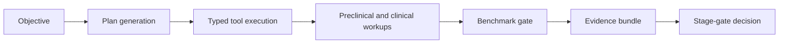

# Chapter 8: End-to-End Walkthrough

## Chapter Summary

This chapter turns the architecture into action with a full objective-to-decision workflow, including campaign execution, preclinical and clinical workups, benchmark gating, and evidence bundling.
It is designed as a repeatable operational template for real team workflows.

## Learning Goals

By the end of this chapter, you should be able to:

Run a practical objective from planning through evidence packaging. Know which artifacts appear at each stage. Recognize where to add quality checks before advancement. Produce a reproducible decision packet for stakeholders.

## Story Thread

This chapter is the full journey: one objective, one execution path, one decision packet.
It is written as a practical playbook for teams that need repeatable outcomes, not just demos.
Follow it as written once, then adapt it to your own disease area and operating constraints.

## 8.1 Scenario Setup

We use a simplified but realistic objective:

"Design and prioritize KRAS campaign strategies with evidence-ready outputs for stage-gate review."

This chapter emphasizes process quality, not biological claims.

## 8.2 Workflow Overview



## 8.3 Step 1: Prepare Runtime

Minimum services:

OpenClaw gateway. `refua-mcp`. Optional `refua-studio` for command-center workflows.

Checklist before first run:

1. verify planner auth configuration
2. verify MCP runtime dependencies are installed
3. verify artifact directory write permissions
4. run dry-run smoke test

## 8.4 Step 2: Generate And Execute Campaign Plan

```bash
ClawCures run \
  --objective "Design and prioritize KRAS campaign strategies" \
  --output artifacts/kras_campaign_run.json
```

What happens internally:

1. objective and system prompt are sent to OpenClaw
2. planner returns strict JSON plan
3. orchestrator validates policy constraints
4. calls are executed through `refua-mcp`
5. results are aggregated into campaign artifact

## 8.5 Step 3: Inspect Campaign Artifact

Open and inspect key sections:

Objective and configuration. Planned vs executed calls. Tool output summaries. `promising_cures` rankings and assessment text. Warnings and policy traces.

Quick quality check:

Do rankings include both upside and risk context? Are unresolved uncertainties explicit? Are references to tools/artifacts present?

## 8.6 Step 4: Run Preclinical Workup

```bash
refua-preclinical workup \
  --config examples/default_study.json \
  --output artifacts/preclinical_workup.json
```

Expected value:

Study planning details. Operational scheduling structure. Bioanalysis summary (if provided inputs). CMC planning context for downstream readiness.

## 8.7 Step 5: Run Clinical Workup

```bash
refua-clinical workup \
  --config examples/default_config.yaml \
  --output-dir artifacts/clinical_workup
```

Expected value:

Simulated operating characteristics. Protocol recommendation options. Optimization/VOI-style guidance. Narrative advice with explicit assumptions.

## 8.8 Step 6: Apply Benchmark Gate

```bash
refua-bench compare \
  --suite benchmarks/sample_suite.yaml \
  --baseline benchmarks/sample_baseline_run.json \
  --candidate artifacts/candidate_run.json \
  --output artifacts/compare.json
```

Interpretation guidance:

Pass: candidate acceptable relative to baseline criteria. Fail: block promotion and investigate. Uncertain: gather additional evidence or adjust design intentionally.

## 8.9 Step 7: Build And Verify Evidence Bundle

```bash
refua-regulatory build \
  --campaign-run artifacts/kras_campaign_run.json \
  --output-dir artifacts/evidence/kras_run_001

refua-regulatory verify \
  --bundle-dir artifacts/evidence/kras_run_001
```

Review expected bundle contents:

Manifest. Decisions. Lineage. Checksums. Checklist outputs.

## 8.10 Step 8: Stage-Gate Review Packet

Before review meeting, assemble:

Objective and scope. Key results and ranking rationale. Preclinical and clinical decision summaries. Benchmark gate status. Evidence verification status. Unresolved risks and proposed next experiments.

This packet should be readable by both technical and non-technical stakeholders.

## 8.11 Artifact Map

| Stage | Artifact Example | Review Owner |
| --- | --- | --- |
| campaign run | `artifacts/kras_campaign_run.json` | platform and modeling |
| preclinical | `artifacts/preclinical_workup.json` | preclinical lead |
| clinical | `artifacts/clinical_workup/*` | clinical strategy lead |
| benchmark | `artifacts/compare.json` | QA/model governance |
| evidence bundle | `artifacts/evidence/kras_run_001/*` | regulatory/QA |

## 8.12 Common Walkthrough Failure Points

Objective too broad, producing low-focus plans. Skipping validation-first patterns. Incomplete artifact capture before review. Unclear ownership of final stage-gate decision.

Treat these as process defects and fix them before scaling campaign volume.

## Key Takeaways

End-to-end quality depends on consistency across every handoff, not just one stage. Artifact completeness is as important as model output quality. Benchmark and governance gates should be integrated before review meetings. A reusable decision packet structure accelerates cross-functional alignment. Repeatable walkthroughs are the fastest path to operational maturity.

## Quick Review Questions

1. Which step in this walkthrough is most error-prone in your environment?
2. What evidence is missing most often before stage-gate discussions?
3. How would you make this workflow rerunnable by another team next week?
4. Which gate outcome should trigger immediate rework instead of debate?
5. What single automation would most improve this walkthrough’s reliability?

## Mini Case Study

**Scenario:** A team completes a full KRAS campaign run but enters stage-gate review without benchmark output or verified evidence bundle.

**Decision Move:** The review is paused. The team executes the missing compare and bundle-verify steps, then regenerates the decision packet.

**Result:** The second review is shorter and more decisive because every claim is traceable to validated artifacts.

**Lesson:** End-to-end workflows fail at the finish line when gate steps are treated as optional.

## 8.13 Quick Self-Audit

Can another team rerun this workflow from artifacts alone? Are decision boundaries documented clearly? Are uncertainties explicit and prioritized? Is there a concrete next-loop plan if decision is "rework"?

## 8.14 Continue Into Domain Deep Dives

Medicinal chemistry and SAR strategy: [Chapter 9](./chapter-09-medicinal-chemistry-and-molecular-optimization.md) and discovery-to-development stage science: [Chapter 10](./chapter-10-drug-discovery-and-development-science.md).

## 8.15 Structured Reference Files

[tool_calls_example.json](./data/tool_calls_example.json). [campaign_lifecycle_example.csv](./data/campaign_lifecycle_example.csv). [traceability_matrix.csv](./data/traceability_matrix.csv).
