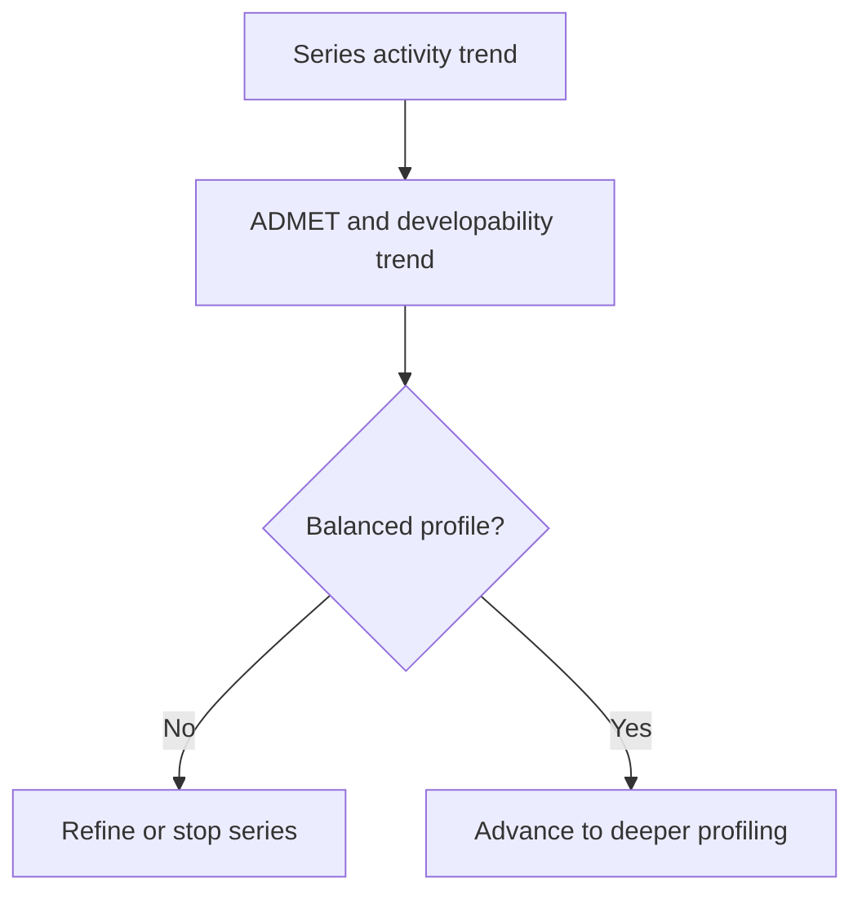

# Chapter 9: Medicinal Chemistry and Molecular Optimization

## Chapter Summary

This chapter presents medicinal chemistry as a disciplined multi-objective optimization process centered on DMTA loops, SAR interpretation, and liability management.
It links chemistry decision-making directly to Refua-supported computational triage and campaign-level orchestration.

## Learning Goals

By the end of this chapter, you should be able to:

- explain medicinal chemistry as a multi-constraint optimization discipline
- run a practical SAR-driven DMTA cycle
- evaluate potency, selectivity, ADMET, and developability together
- connect chemistry decisions to Refua and ClawCures workflows

## Story Thread

Imagine a chemistry team reviewing a series that just improved potency but worsened liabilities.
What happens next is the heart of medicinal chemistry: balancing competing signals without losing momentum.
This chapter focuses on those tradeoff decisions and how to make them systematically.

## 9.1 Medicinal Chemistry In One Sentence

Medicinal chemistry converts biological hypotheses into molecules that are both pharmacologically effective and practically developable.

It is not just discovering active compounds.
It is systematically reducing risk while preserving efficacy potential.

## 9.2 DMTA As Operating System

- Design: choose modifications and hypotheses
- Make: synthesize or procure analogs
- Test: run biochemical/cellular/ADMET assays
- Analyze: update SAR and choose next moves

This loop repeats until a series is advanced or stopped.

## 9.3 SAR Fundamentals

Structure-activity relationship (SAR) means mapping structural changes to measured outcomes.

A disciplined SAR program:

1. changes one variable at a time when possible
2. tracks assay context and conditions rigorously
3. compares trends across multiple endpoints
4. avoids over-reading one noisy assay result

## 9.4 Core Optimization Axes

| Axis | Core Question | Example Data |
| --- | --- | --- |
| Potency | Does the molecule engage target strongly? | IC50, Ki, Kd |
| Selectivity | Is off-target risk controlled? | panel counterscreens |
| Exposure | Can target tissue exposure be sustained? | PK AUC, Cmax, clearance |
| Safety | Are liabilities acceptable for intended use? | hERG, Ames, cytotoxicity patterns |
| Developability | Can chemistry and formulation scale? | solubility, stability, process feasibility |

Teams that optimize only potency typically pay later in attrition.

## 9.5 Property Space Reasoning

Medicinal chemistry uses property trends as early guidance.
These are heuristics, not laws.

| Property | Why It Helps | Common Caution |
| --- | --- | --- |
| molecular weight | proxy for complexity/permeability burden | very high values can strain permeability and formulation |
| lipophilicity | impacts potency, permeability, off-target behavior | very high values often increase safety and clearance risk |
| polar surface area | informs membrane transport tendencies | extremes can hurt oral exposure |
| H-bond counts | affect permeability and binding patterns | high polarity can reduce passive diffusion |
| solubility | affects assay validity and exposure | poor solubility can mask real activity |

Reference file: [medchem_property_guide.csv](./data/medchem_property_guide.csv)

## 9.6 Efficiency Metrics

Potency is not enough.
Efficiency metrics help normalize quality.

- ligand efficiency (LE): potency relative to molecular size
- lipophilic ligand efficiency (LLE/LipE): potency relative to lipophilicity

These metrics help avoid "large lipophilic potency traps."

## 9.7 Common Medicinal Chemistry Strategies

- bioisosteric replacement for liability relief
- ring constraints for conformational control
- polarity tuning for exposure balance
- soft-spot blocking to improve metabolic stability
- scaffold simplification for synthetic tractability

No strategy is universally correct; context decides.

## 9.8 Early Liability Management

High-value early checks:

- reactive motifs and chemical instability
- likely assay-interference motifs
- CYP inhibition concern signals
- hERG concern trends
- genotoxicity concern flags

Catching these early saves substantial downstream cost.

## 9.9 Series-Level Decision Framework

Decision should be series-based, not compound-of-the-week based.

## 9.10 Integrating Refua In Chemistry Loops

`refua` can support chemistry decision loops by providing:

- structural context for interaction hypotheses
- affinity-oriented scoring signals
- molecule property and optional ADMET profile context

`ClawCures` can then orchestrate iteration plans and capture ranking artifacts.

## 9.11 Practical DMTA Workflow In This Stack

1. generate candidate ideas from SAR hypotheses
2. run computational triage with `refua` and typed MCP calls
3. run targeted wet-lab tests and capture lineage
4. update series ranking with explicit tradeoff rationale
5. gate advancement with quality and governance checks

## 9.12 Medicinal Chemistry Anti-Patterns

- optimizing one metric at the expense of all others
- making too many structural changes between iterations
- ignoring synthetic route realism until late
- trusting single-assay outcomes without replication

## 9.13 Readable Reporting Template

For each series review:

- series hypothesis
- structural change set
- potency and selectivity trend summary
- ADMET/developability trend summary
- key risks and mitigation options
- explicit go/iterate/stop recommendation

Consistency in reporting improves decision speed and quality.

## Key Takeaways

- Medicinal chemistry success requires balancing potency, safety, exposure, and developability.
- DMTA loops work best when hypothesis changes are disciplined and measurable.
- Property heuristics guide direction but do not replace experimental evidence.
- Series-level decisions are stronger than one-compound decision habits.
- Structured reporting makes cross-functional decisions faster and clearer.

## Quick Review Questions

1. Which current SAR trend in your work is strongest, and what supports that claim?
2. Where are you likely over-optimizing potency at the expense of other constraints?
3. Which liability signal should trigger a series-level pause right now?
4. What experiment would reduce the most uncertainty in your next DMTA iteration?
5. What evidence threshold defines an acceptable lead-optimization handoff?

## Mini Case Study

**Scenario:** Series A improves potency 8-fold over three rounds, but hERG and solubility trends worsen at each step.

**Decision Move:** The team pauses potency-first optimization, introduces a property-balanced redesign objective, and tracks LE/LLE with liability thresholds.

**Result:** Potency drops modestly, but overall profile quality improves enough to keep the series viable for advancement.

**Lesson:** A slightly weaker but balanced profile often beats a potent but unstable series.

## 9.14 Chapter Checkpoint

You are ready for Chapter 10 if you can answer:

- what tradeoff currently blocks your top series
- which two experiments would reduce uncertainty most per week of work
- what evidence threshold defines a "development-ready" handoff

## 9.15 Continue Reading

- broader development-stage science and gates: [Chapter 10](./chapter-10-drug-discovery-and-development-science.md)
- lifecycle integration and ownership: [Chapter 5](./chapter-05-program-lifecycle-modules.md)
