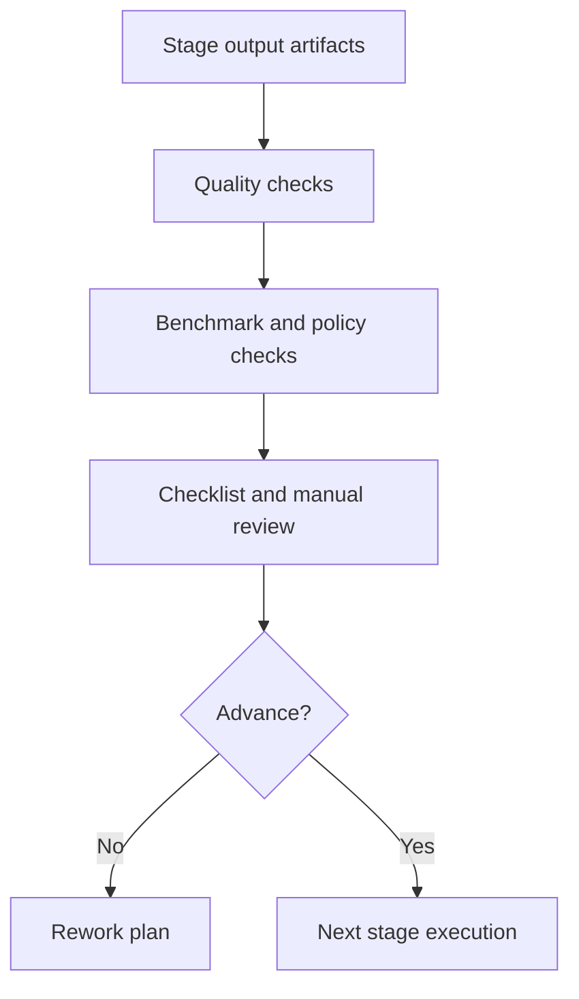

# Chapter 10: Drug Discovery and Development Science

## Chapter Summary

This chapter connects discovery outputs to development readiness by outlining translational questions, preclinical and clinical decision science, CMC fundamentals, and stage-gate logic.
It emphasizes evidence-backed progression and explicit uncertainty management.

## Learning Goals

By the end of this chapter, you should be able to:

Distinguish discovery success from development readiness. Reason about translational science between preclinical and clinical stages. Apply stage-gate logic with explicit evidence expectations. Map major development-science tasks onto Refua ecosystem modules.

## Story Thread

This chapter sits at the critical handoff where promising discovery outputs face development reality.
Teams must decide whether evidence is strong enough to move forward, hold, or rework.
The narrative here is about disciplined progression: advancement by evidence, not by excitement.

## 10.1 Discovery And Development Are Different Disciplines

Discovery asks: what candidate should we advance?
Development asks: can we deliver this candidate safely, reproducibly, and effectively to patients?

Both are scientific, but they optimize different constraints.

| Domain | Dominant Constraint | Typical Output |
| --- | --- | --- |
| Discovery | mechanism and candidate quality | optimized lead series |
| Development | quality, safety, operational reproducibility | stage-gate package for clinical progression |

## 10.2 Stage Model

A strong platform keeps this model explicit in data and workflow design.

## 10.3 Translational Science Questions

Before clinical advancement:

Are exposure targets plausible for intended effect? Are safety margins and monitoring assumptions clear? Are endpoints/biomarkers aligned with mechanism? Does trial design handle heterogeneity and intercurrent events?

`refua-clinical` provides simulation and protocol-design support for these questions.

## 10.4 Preclinical Development Science

`refua-preclinical` supports planning and workups for:

GLP-style study planning constructs. Operational schedules for in vivo activities. Bioanalysis summaries. CMC planning outputs, batch records, stability assessments, release evaluation.

This does not replace domain experts. It structures repeatable decision support.

## 10.5 Clinical Development Science

Core clinical design science concerns:

Sample-size adequacy under realistic uncertainty. Interim and stopping strategy behavior. Adaptive randomization effects. External-control borrowing assumptions. Transportability risk when population shifts.

Simulation helps teams compare design options before expensive execution.

## 10.6 CMC As Development Backbone

CMC concerns include:

Formulation feasibility. Process consistency and control strategy. Stability over lifecycle. Release criteria with clear pass/hold logic.

Weak CMC planning can derail otherwise promising biology.

## 10.7 Stage-Gate Mechanics

Reference map: [development_stage_gates.csv](./data/development_stage_gates.csv)

## 10.8 Risk Taxonomy

| Risk Category | Typical Signal | Mitigation Direction |
| --- | --- | --- |
| biological risk | weak mechanism linkage | strengthen target and biomarker strategy |
| safety risk | adverse trend or narrow margin | adjust chemistry, exposure, monitoring plan |
| clinical design risk | low power or high bias sensitivity | revise protocol via simulation |
| operational risk | enrollment/protocol complexity bottlenecks | simplify design and site operations |
| CMC risk | instability or process variability | tighten control strategy and validation plan |
| evidence risk | missing lineage or unresolved checklist items | block progression until remediation |

## 10.9 Ecosystem Mapping To Development Tasks

| Task | Module Support |
| --- | --- |
| campaign objective and plan loops | `ClawCures`, `clawcures-ui` |
| structural and affinity evidence | `refua`, `refua-mcp` |
| preclinical and CMC planning | `refua-preclinical` |
| clinical simulation and protocol optimization | `refua-clinical` |
| wet-lab operational lineage | `refua-wetlab` |
| release-quality model checks | `refua-bench` |
| evidence packaging and integrity | `refua-regulatory` |
| runtime standardization | `refua-deploy` |

## 10.10 Decision Hygiene For Leadership Reviews

Before investment or stage advancement decisions:

1. verify evidence packet completeness
2. ensure assumptions are explicit and testable
3. confirm benchmark and checklist status
4. capture unresolved risks with owners and due dates
5. document proceed/hold/stop rationale in structured format

This prevents hindsight bias and improves institutional learning.

## 10.11 Common Development Mistakes

Advancing on enthusiasm without gate completeness. Underweighting CMC readiness early. Presenting single-point predictions without uncertainty ranges. Poor integration between wet-lab operations and governance artifacts.

## 10.12 Accessible Science Communication Pattern

To make complex development science readable:

Define each decision question explicitly. Show evidence tables before conclusions. Separate known facts from assumptions. Include plain-language risk summary. Include concrete next-step experiment or analysis.

This style improves cross-functional alignment.

## Key Takeaways

Discovery success and development readiness are different thresholds. Stage-gate progression requires evidence completeness, not momentum. Translational design quality depends on explicit assumptions and scenario testing. CMC readiness is a core development constraint, not a late add-on. Clear decision hygiene improves both speed and defensibility.

## Quick Review Questions

1. What currently blocks your top program from development-readiness?
2. Which translational assumption in your plan is most weakly supported?
3. Where should CMC evidence be strengthened before advancement?
4. Which gate criterion should be tightened to reduce downstream risk?
5. How are unresolved uncertainties documented in your stage-gate packet?

## Mini Case Study

**Scenario:** A program shows strong discovery-stage signals and leadership wants immediate advancement, but CMC stability data is incomplete.

**Decision Move:** The team moves to a \"conditional hold\" decision: complete stability milestones, rerun clinical design sensitivity scenarios, then reconvene.

**Result:** The next review proceeds with stronger evidence, fewer unresolved risks, and clearer ownership of remaining actions.

**Lesson:** Development readiness is earned through gate completeness, not enthusiasm.

## 10.13 Chapter Checkpoint

You completed this guidebook core if you can explain:

What separates discovery success from development readiness. What evidence is required for your next stage-gate review. Which uncertainty is currently highest-value to reduce next.

## 10.14 Continue Reading

Glossary for quick term alignment: [Appendix A](./appendix-a-glossary.md) and artifact contracts and schema examples: [Appendix B](./appendix-b-artifacts-and-schemas.md).
