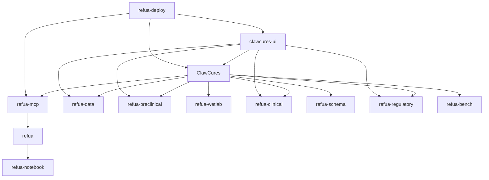

# AgentCures

**Agentic software for end-to-end drug discovery execution**

AgentCures builds an integrated stack for planning, simulation, model inference, execution, evidence generation, and deployment in drug discovery programs.

## Guidebook

[Click to read the Guidebook](https://github.com/agentcures/.github/tree/main/guidebook)

## Platform Topology

## Repository Map

| Repository | Purpose | Key Features |
| --- | --- | --- |
| [`agentcures/ClawCures`](https://github.com/agentcures/ClawCures) | Drug disovery agent (OpenClaw based) | OpenClaw planning, autonomous loops, policy checks, portfolio ranking |
| [`agentcures/NanoCures`](https://github.com/agentcures/NanoCures) | Drug discovery agent (NanoClaw based) | Container-isolated execution, per-group sessions, sender allowlists, translational workflow skills |
| [`agentcures/refua`](https://github.com/agentcures/refua) | Core drug discovery ML toolkit | Boltz2 fold/affinity, BoltzGen design, unified Python API |
| [`agentcures/refua-mcp`](https://github.com/agentcures/refua-mcp) | Typed MCP server for Refua tools | Structured tool contracts, fold/design/affinity, optional clinical and preclinical extras |
| [`agentcures/clawcures-ui`](https://github.com/agentcures/clawcures-ui) | Web control plane | Mission planning, job telemetry, trial and evidence workflows |
| [`agentcures/refua-data`](https://github.com/agentcures/refua-data) | Data layer | Curated catalogs, API ingestion, local caching, parquet materialization |
| [`agentcures/refua-preclinical`](https://github.com/agentcures/refua-preclinical) | Preclinical operations | GLP study planning, in vivo scheduling, bioanalysis pipelines |
| [`agentcures/refua-wetlab`](https://github.com/agentcures/refua-wetlab) | Wet lab operations | Experiment orchestration, assay tracking, sample lifecycle coordination |
| [`agentcures/refua-clinical`](https://github.com/agentcures/refua-clinical) | Clinical simulation | PK/PD virtual patients, adaptive trial simulation, protocol optimization |
| [`agentcures/refua-schema`](https://github.com/agentcures/refua-schema) | Portfolio object model | `Portfolio -> Disease -> Rationale -> Drug` hierarchy, reused Refua objects, JSON/YAML round-tripping |
| [`agentcures/refua-regulatory`](https://github.com/agentcures/refua-regulatory) | Regulatory evidence and audit | Decision lineage, signed bundles, checklist gates |
| [`agentcures/refua-bench`](https://github.com/agentcures/refua-bench) | Benchmarking and regression gates | Statistical comparisons, provenance capture, baseline promotion |
| [`agentcures/refua-notebook`](https://github.com/agentcures/refua-notebook) | Notebook visualization layer | Rich IPython and Jupyter rendering for Refua objects |
| [`agentcures/refua-deploy`](https://github.com/agentcures/refua-deploy) | Deployment generation | Kubernetes/Compose/single-machine bundles for cloud and on-prem |

## Live Repository Cards

| Repository | Live Snapshot |
| --- | --- |
| [`agentcures/refua`](https://github.com/agentcures/refua) |    |
| [`agentcures/ClawCures`](https://github.com/agentcures/ClawCures) |    |
| [`agentcures/NanoCures`](https://github.com/agentcures/NanoCures) |    |
| [`agentcures/refua-mcp`](https://github.com/agentcures/refua-mcp) |    |
| [`agentcures/clawcures-ui`](https://github.com/agentcures/clawcures-ui) |    |
| [`agentcures/refua-data`](https://github.com/agentcures/refua-data) |    |
| [`agentcures/refua-preclinical`](https://github.com/agentcures/refua-preclinical) |    |
| [`agentcures/refua-wetlab`](https://github.com/agentcures/refua-wetlab) |    |
| [`agentcures/refua-clinical`](https://github.com/agentcures/refua-clinical) |    |
| [`agentcures/refua-schema`](https://github.com/agentcures/refua-schema) |    |
| [`agentcures/refua-regulatory`](https://github.com/agentcures/refua-regulatory) |    |
| [`agentcures/refua-bench`](https://github.com/agentcures/refua-bench) |    |
| [`agentcures/refua-notebook`](https://github.com/agentcures/refua-notebook) |    |
| [`agentcures/refua-deploy`](https://github.com/agentcures/refua-deploy) |    |

## End-to-End Program Flow

1. Define mission intent in `clawcures-ui` or `ClawCures`.
2. Build candidate evidence and portfolio objects through `refua`, `refua-mcp`, `refua-data`, and `refua-schema`.
3. Simulate wet lab, preclinical, and clinical strategy with `refua-wetlab`, `refua-preclinical`, and `refua-clinical`.
4. Gate quality with `refua-bench`.
5. Package traceable evidence with `refua-regulatory`.
6. Render and apply runtime bundles with `refua-deploy`.

## External Links

- Website: https://www.agentcures.com
- News: https://www.agentcures.com/news
